# run_1 results -- systematic bias, 0PA against 0PA+PN

Generated 2026-09-19T15:10:12+00:00 by
`make_results_md.py`, from the per-source records in this folder.  Nothing below is
transcribed by hand.

> Method, conventions and assumptions: **[`METHOD.md`](METHOD.md)**.  This page is generated
> from the per-source records and carries only the numbers.

## What this is

A circular EMRI population at SNR = 200, A and E channels only, injected with a
multiplicative environmental term on the flux, `env = 1 + A_PM (p/10)^n_PM`, `n_PM = 8`.
Each source is fitted by two vacuum recovery models:

* `0PA` -- the eight vacuum parameters `m1, m2, a, p0, e0, qS, phiS, Phi_phi0`
* `0PA+PN` -- the same eight plus `C_p`, the amplitude of a PN flux deviation

The question is whether the extra PN freedom absorbs the environmental deviation, and
whether absorbing it reduces the *absolute* parameter bias or only the overlap.

## Where the numbers come from

The fit vectors are the ones the searches already found.  Counting each model's arm
separately, 39
of the 44 arms come from the population run (`results_env_cv.json`) and
5
from the converged follow-ups in `harder_environmental/`.  Each arm is taken from whichever
run reached the higher overlap for that model, which for source 14 means its two arms come
from different runs.  Nothing was refitted.

What is new is sigma.  Each model's Fisher was recomputed **at its own best fit** with a
finer derivative stencil -- order 8 over a 24-point stability
ladder, against order 6 over 12 in the population run -- so the `b/sigma` column no longer
depends on the choice of step size.  For the PN model the `C_p` finite-difference step is
recalibrated per source before its Fisher is taken.

Bias on an angle is taken after unwrapping to `(-pi, pi]`, so a fit on the far side of
2 pi is not counted as a large error.

## Headline

* `PN >= 0PA` on overlap holds for 22 of 22 converged sources, and for 22 of 22 counting the ones that did not converge.
* The medians below are over the 22 converged sources.
* `m1`: median |bias| ratio PN / 0PA = 1 over 22 sources.
* `m2`: median |bias| ratio PN / 0PA = 1 over 22 sources.
* `a`: median |bias| ratio PN / 0PA = 0.999 over 22 sources.
* `p0`: median |bias| ratio PN / 0PA = 0.94 over 22 sources.
* `e0`: median |bias| ratio PN / 0PA = 1 over 19 sources.
* `qS`: median |bias| ratio PN / 0PA = 0.843 over 22 sources.
* `phiS`: median |bias| ratio PN / 0PA = 0.93 over 22 sources.
* `Phi_phi0`: median |bias| ratio PN / 0PA = 0.903 over 22 sources.

## Sources in the analysis (22)

`max b/sigma` is the largest ratio the model shows over its parameters, excluding `e0`.
A `!` marks a source whose climb did not converge: it is shown, and held out of the
population medians below.

| idx | p0 | m1 / 1e6 | fit from | ov 0PA | ov 0PA+PN | chi2 0PA | chi2 0PA+PN | C_p | max b/sigma 0PA | max b/sigma 0PA+PN |
|---|---|---|---|---|---|---|---|---|---|---|
| 0 | 4.938 | 6.871 | population | 0.9999999982 | 0.9999999989 | 0.0001453 | 9.021e-05 | 0.3008 | 0.0336 | 0.00827 |
| 2 | 5.352 | 6.284 | population | 0.9999999619 | 0.9999999622 | 0.003079 | 0.003048 | 0.002458 | 0.0602 | 0.0567 |
| 3 | 4.877 | 7.766 | population | 0.9999999974 | 0.9999999976 | 0.0002059 | 0.0001916 | 0.05547 | 0.0324 | 0.0123 |
| 4 | 6.387 | 4.780 | population | 0.9999998679 | 0.9999998680 | 0.01098 | 0.01093 | 0.0005127 | 0.111 | 0.132 |
| 5 | 4.854 | 9.598 | population | 0.9999999945 | 0.9999999973 | 0.0004432 | 0.0002182 | 0.6883 | 0.0319 | 0.0132 |
| 6 | 7.234 | 3.508 | population | 0.9999978289 | 0.9999978289 | 0.18 | 0.18 | -6.103e-14 | 0.499 | 0.498 |
| 7 | 5.816 | 4.798 | population | 0.9999999804 | 0.9999999843 | 0.001636 | 0.001322 | 0.2963 | 0.0939 | 0.034 |
| 8 | 7.758 | 3.780 | harder_environ | 0.9278151522 | 0.9999992444 | 5589 | 0.06095 | 18.84 | 1.3e+03 | 0.504 |
| 9 | 4.881 | 8.544 | population | 0.9999999965 | 0.9999999966 | 0.000278 | 0.0002762 | 0.01287 | 0.0235 | 0.0141 |
| 10 | 6.485 | 5.369 | population | 0.9999948883 | 0.9999984256 | 0.4093 | 0.1281 | -0.01009 | 0.631 | 0.309 |
| 11 | 5.967 | 6.339 | population | 0.9999998733 | 0.9999998736 | 0.01014 | 0.01012 | -0.001428 | 0.197 | 0.0891 |
| 13 | 10.309 | 2.067 | harder_environ | 0.9998517492 | 0.9999753187 | 11.88 | 2.031 | 74.55 | 4.31 | 2.73 |
| 14 | 9.451 | 2.135 | harder_environ / population | 0.7742450032 | 0.9206022525 | 1.791e+04 | 6203 | 0.4167 | 806 | 42.9 |
| 15 | 7.396 | 3.700 | population | 0.9999906193 | 0.9999906207 | 0.7507 | 0.7506 | -0.0002864 | 0.766 | 0.574 |
| 17 | 5.356 | 5.999 | population | 0.9999999460 | 0.9999999936 | 0.004322 | 0.0005119 | 0.337 | 0.0671 | 0.0201 |
| 18 | 6.988 | 4.073 | population | 0.9999874250 | 0.9999996468 | 1.017 | 0.02917 | 1.711 | 0.878 | 1.07 |
| 19 | 7.193 | 3.736 | population | 0.9999965333 | 0.9999972798 | 0.2775 | 0.2221 | -0.03815 | 0.624 | 0.514 |
| 20 | 5.981 | 4.731 | population | 0.9999999567 | 0.9999999567 | 0.0035 | 0.003496 | -2.795e-05 | 0.0946 | 0.0517 |
| 21 | 5.183 | 6.292 | population | 0.9999999703 | 0.9999999981 | 0.00238 | 0.0001569 | 0.6307 | 0.0488 | 0.0112 |
| 22 | 5.220 | 6.225 | population | 0.9999999711 | 0.9999999972 | 0.002317 | 0.0002242 | 0.5179 | 0.0423 | 0.0137 |
| 23 | 6.134 | 5.852 | population | 0.9999998399 | 0.9999998786 | 0.01281 | 0.009712 | 0.9099 | 0.218 | 0.0957 |
| 24 | 6.845 | 3.599 | population | 0.9999989446 | 0.9999989451 | 0.08447 | 0.08443 | 0.0004222 | 0.307 | 0.304 |

## In the analysis, but not converged

These are plotted -- hollow -- and tabulated above, because a failure at high `p0` is itself
the result.  They are excluded from the per-parameter medians.

Every source in the analysis converged.

## Not in the analysis

| idx | p0 | why it is not here |
|---|---|---|
| 16 | 11.752 | no PN search converged: four attempts, three with DE collapsing to an overlap of ~1e-3, so its numbers say where the optimiser stopped rather than what the template absorbs |

## Per parameter, across the population

`median ratio` is the median of `|bias|_PN / |bias|_0PA`; below 1 means the PN template
reduced the bias.  `tie` counts sources where the two agree to within 1e-06 relative,
which is what happens when the PN climb finds no ascent direction and lands back on the 0PA
fit -- a PN template at `C_p = 0` *is* the 0PA template.

| param | median \|b\| 0PA | median \|b\| 0PA+PN | median ratio | PN smaller | PN larger | tie | median b/sigma 0PA | median b/sigma 0PA+PN |
|---|---|---|---|---|---|---|---|---|
| m1 | 8.518 | 5.671 | 1 | 11 | 10 | 1 | 0.0281 | 0.00508 |
| m2 | 4.44e-05 | 7.468e-05 | 1 | 10 | 11 | 1 | 0.0419 | 0.00799 |
| a | 2.537e-07 | 2.528e-07 | 0.999 | 11 | 10 | 1 | 0.0372 | 0.00637 |
| p0 | 4.024e-06 | 3.554e-06 | 0.94 | 14 | 7 | 1 | 0.0288 | 0.00397 |
| e0 * | 2.803e-05 | 3.564e-06 | 1 | 7 | 7 | 5 | 151 | 17.9 |
| qS | 5.967e-05 | 4.552e-05 | 0.843 | 13 | 8 | 1 | 0.0235 | 0.0153 |
| phiS | 0.0004526 | 0.0004512 | 0.93 | 18 | 3 | 1 | 0.0382 | 0.036 |
| Phi_phi0 | 0.002612 | 0.002511 | 0.903 | 16 | 5 | 1 | 0.113 | 0.0924 |

`*` `e0 = 0` sits on its own physical boundary, so its Fisher direction is degenerate and
sigma(e0) is not a confidence interval.  Its absolute bias is meaningful; its `b/sigma` is
not, and the figure marks that panel rather than plotting a number in the thousands.

## Figures

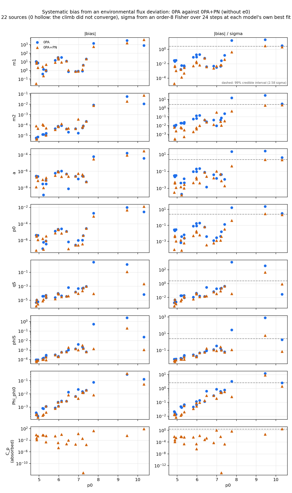

One row per parameter.  Left: absolute bias, which needs no Fisher.  Right: the same bias
in units of that model's own sigma.  Reading them together matters -- a PN model can show a
smaller `b/sigma` with an unchanged absolute bias, purely because `C_p` correlates with the
vacuum parameters and inflates their sigma.

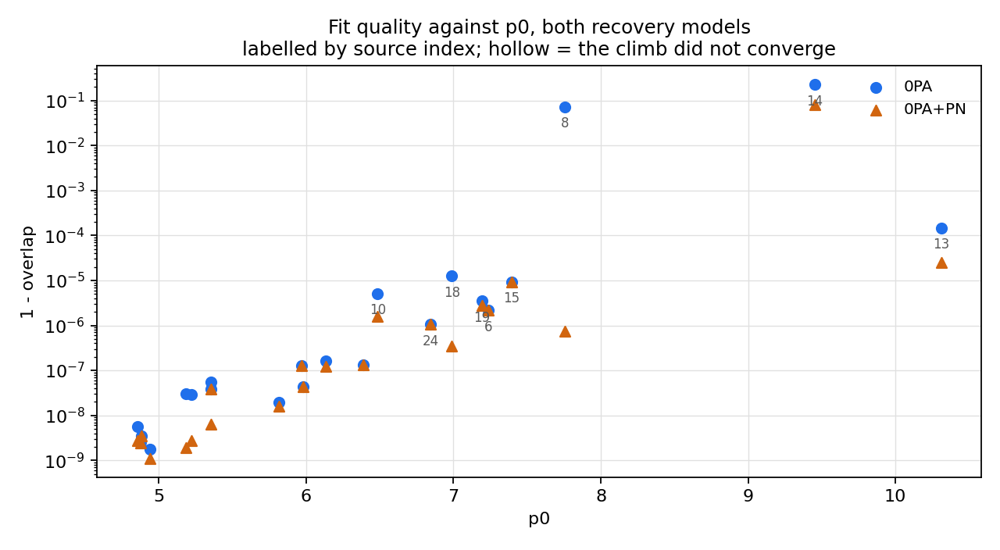

`1 - overlap` against `p0`, both models, the sources the fit struggled with labelled by
index.

### Per source, summarised

The two figures above are per parameter.  These compress each source to one number per model,
so the population reads at a glance.  Every quantity is computed over two parameter blocks --
once over the seven parameters whose sigma means what it says, and once with `e0` added back,
because `e0` sits on its physical boundary and its near-null Fisher direction dominates
whatever it is included in.  The deviation amplitude `C_p` is held out of all of them: it is
injected at zero and is the thing being absorbed, not a parameter whose bias is measured.

**Reference lines are credible regions, not 1 sigma.**  A flat line at 1 is the wrong yardstick
for both quantities here.  For a single parameter it is the 68.3% interval, an odd level to
judge a systematic against.  For the n-d bias it is worse: `sqrt(b^T M b) = 1` is *not* the 68%
region of a `k`-dimensional Gaussian.  The radius enclosing probability `p` is
`sqrt(chi2_ppf(p, k))`, which grows with `k` -- at `k = 7` the 90% region is at **3.47 sigma**
and the 99% at **4.30**.  Judging a 7-d bias against 1.0 overstates how biased everything is
by a factor of three or four.  Each figure is drawn at both levels; `_p90` is the 90% version.

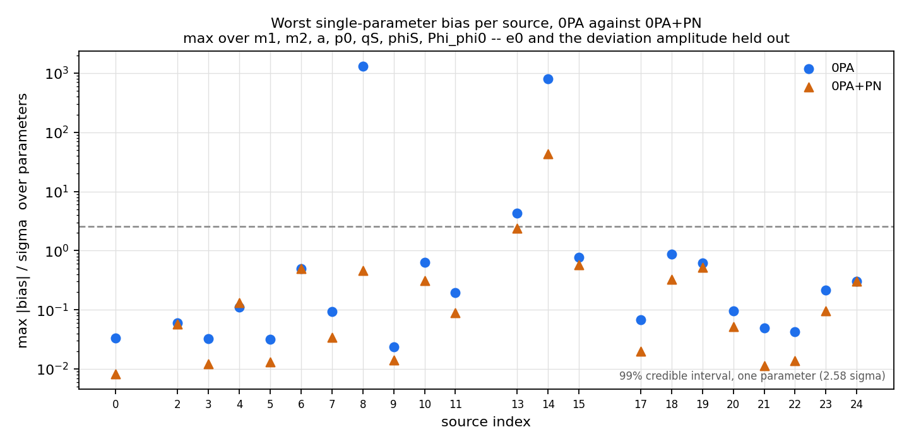

The worst `|bias|/sigma` any single parameter shows, per source.  This is the number that
decides whether a source's parameter estimate is usable at all: one parameter outside its
credible interval is enough to make the answer wrong, however well the other six sit.

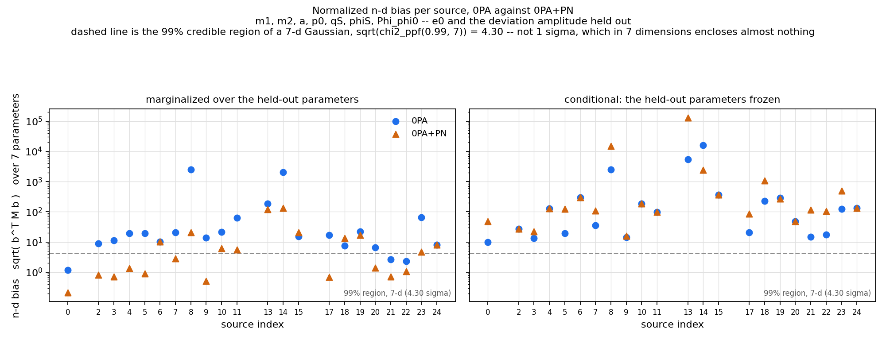

The n-d bias, `sqrt(b^T M b)` over the same seven parameters -- the length of the whole bias
vector in units of the error ellipsoid, which is the quantity the CV formalism actually
bounds.  Two panels, same bias vector, differing only in what is done with the held-out
parameters:

* **marginalized** -- `M = (C_vv)^-1`, the inverse of the kept block of the *covariance*.
  The held-out parameters have been integrated over, so the freedom they carry is still
  paid for.  This is the SK/CV convention.
* **conditional** -- `M = G_vv`, the kept block of the *Fisher* itself, which is the inverse
  covariance with the held-out parameters frozen at their fitted values.

`G_vv >= (C_vv)^-1` in the Loewner order, so the conditional number is never the smaller of
the two.  The gap between the panels is what the extra freedom costs: for `0PA+PN` it is the
price of letting `C_p` float, and it is the reason a PN fit can show a smaller normalized
bias without its absolute bias having moved at all.

**The conditional panel is not a like-for-like contest between the models.**  `0PA` freezes
only `e0`; `0PA+PN` freezes `e0` *and* `C_p`, so PN is judged against a tighter yardstick.
The marginalized panel is the fair comparison; the conditional one is for comparing each
model against itself.

### How many sources are actually biased

| block | quantity | region | threshold | 0PA outside | 0PA+PN outside |
|---|---|---|---|---|---|
| all, no e0 (7) | max 1-d | 99% | 2.58 sigma | 3/22 | **1/22** |
| all, no e0 (7) | n-d, marginalized | 99% | 4.30 sigma | 19/22 | **11/22** |
| all, no e0 (7) | max 1-d | 90% | 1.64 sigma | 3/22 | **2/22** |
| all, no e0 (7) | n-d, marginalized | 90% | 3.47 sigma | 19/22 | **11/22** |
| all, with e0 (8) | max 1-d | 99% | 2.58 sigma | 15/22 | **15/22** |
| all, with e0 (8) | n-d, marginalized | 99% | 4.48 sigma | 22/22 | **17/22** |
| all, with e0 (8) | max 1-d | 90% | 1.64 sigma | 16/22 | **15/22** |
| all, with e0 (8) | n-d, marginalized | 90% | 3.66 sigma | 22/22 | **17/22** |
| intrinsic, no e0 (4) | max 1-d | 99% | 2.58 sigma | 3/22 | **1/22** |
| intrinsic, no e0 (4) | n-d, marginalized | 99% | 3.64 sigma | 17/22 | **9/22** |
| intrinsic, no e0 (4) | max 1-d | 90% | 1.64 sigma | 3/22 | **2/22** |
| intrinsic, no e0 (4) | n-d, marginalized | 90% | 2.79 sigma | 19/22 | **9/22** |
| intrinsic, with e0 (5) | max 1-d | 99% | 2.58 sigma | 15/22 | **15/22** |
| intrinsic, with e0 (5) | n-d, marginalized | 99% | 3.88 sigma | 21/22 | **16/22** |
| intrinsic, with e0 (5) | max 1-d | 90% | 1.64 sigma | 16/22 | **15/22** |
| intrinsic, with e0 (5) | n-d, marginalized | 90% | 3.04 sigma | 22/22 | **16/22** |

### What the PN freedom buys

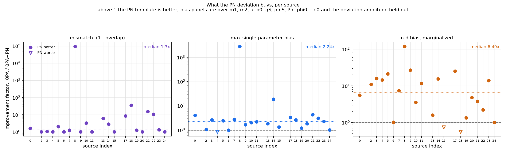

Per source, the factor `0PA / 0PA+PN` on each headline quantity -- above 1 means PN improved
things and the height is the factor.  Plotting the ratio rather than the two values is the
point: the absolute numbers span five decades across the population, which hides a consistent
gain completely.  Mismatch uses `1 - overlap`, not overlap, because `0.9999 -> 0.999999` is a
hundredfold improvement and a difference of `1e-4`, and only the first of those is meaningful.

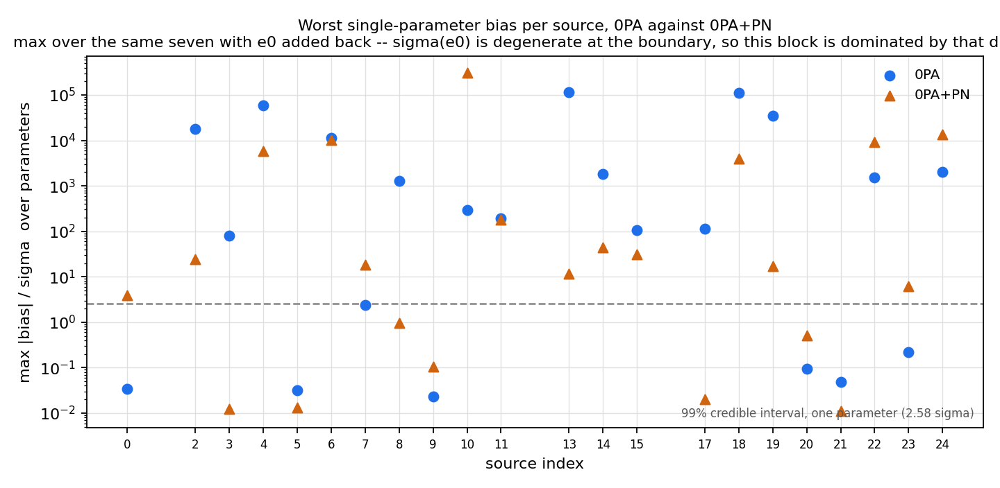

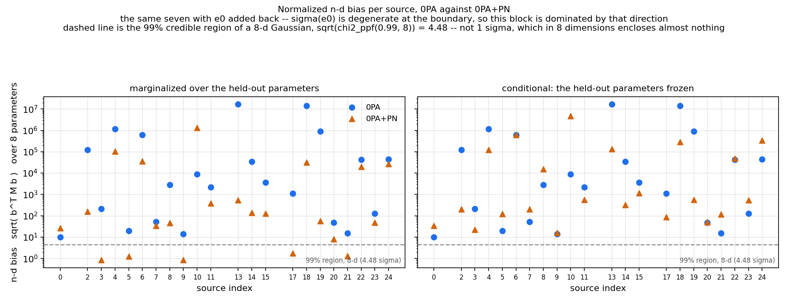

The same two over the block that keeps `e0`.  Read them against the pair above: the
difference is the boundary direction's contribution, not new information about the fit.

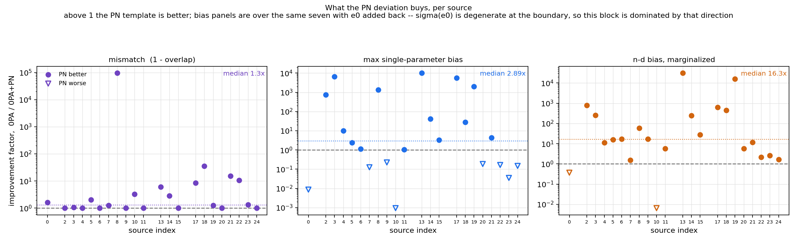

### Intrinsic parameters only

The same three quantities over `m1, m2, a, p0` alone -- sky position and initial phase held
out along with `e0`, and `e0` added back in the second pair.  This is the narrower and harder
question.  A template that absorbs an environmental deviation by shifting the sky position
has not damaged the measurement in the way that one absorbing it into the masses has, so
restricting to the intrinsic block asks whether the PN freedom protects the astrophysics
rather than just the fit.

Note that the credible-region threshold moves with the block: at `k = 4` the 99% region sits
at **3.64 sigma** rather than the 4.30 of the seven-parameter block, because a smaller space
needs a smaller radius to enclose the same probability.  The counts below are already
computed against the right threshold for each block.

These figures live in **[`intrinsic/`](intrinsic/)**, under the same four filenames as the
top-level ones, so the two folders can be read side by side.  See
[`intrinsic/README.md`](intrinsic/README.md) for that block on its own.

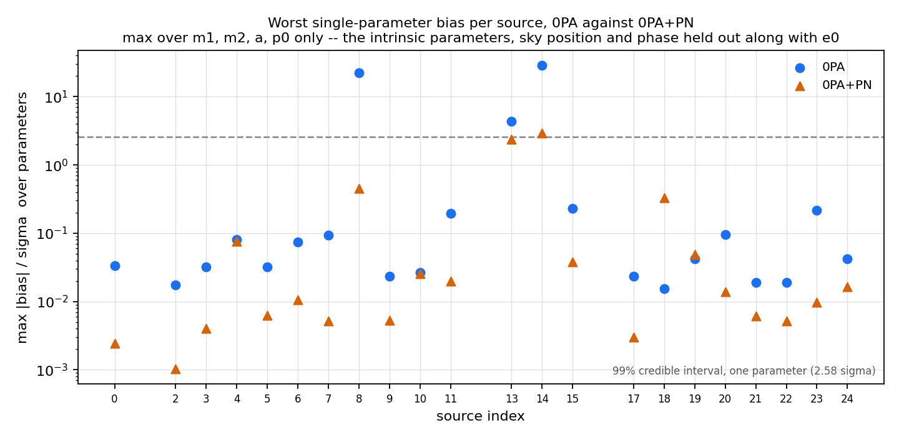

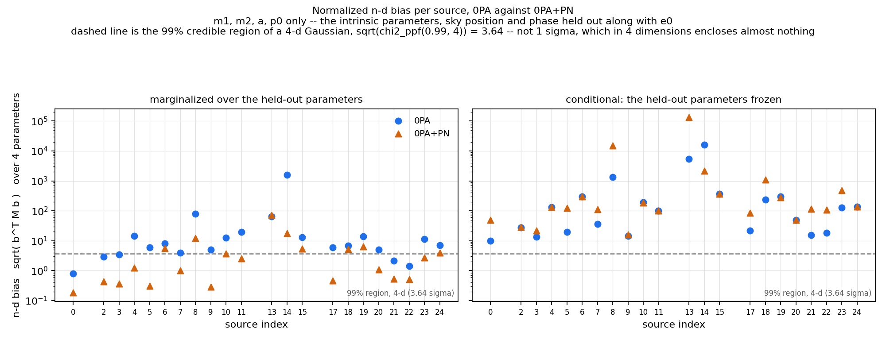

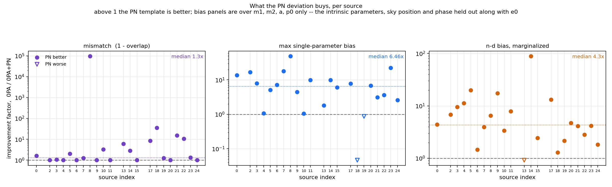

With `e0` restored to the intrinsic block:

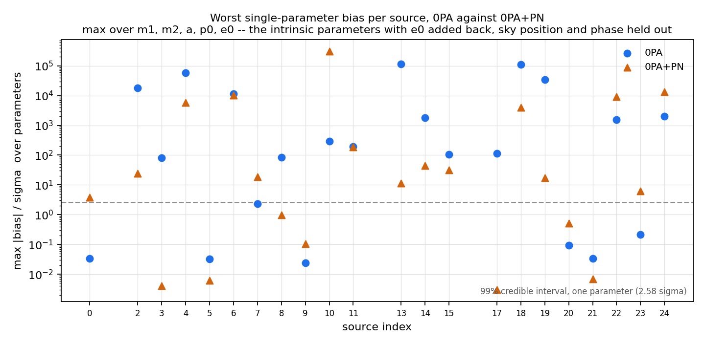

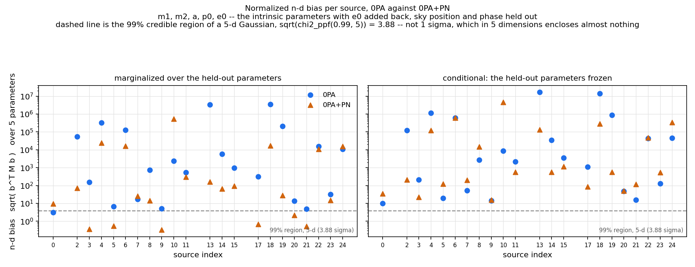

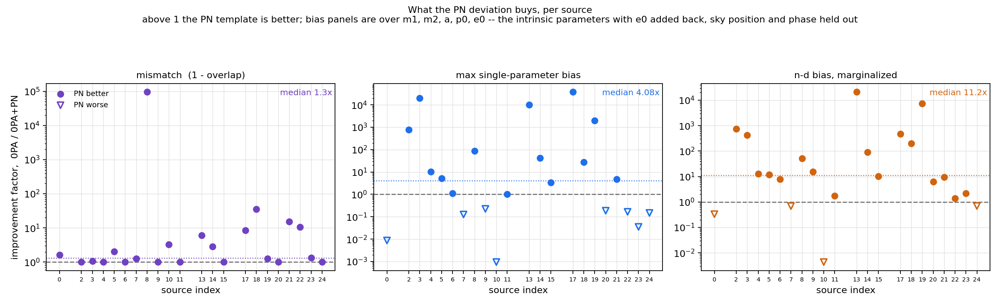

## Is the Fisher well enough conditioned?

Short answer, from the records rather than from assertion:

Across all 44 model arms the raw condition number runs from `4.8e+20` to `4.9e+25`.  Jacobi rescaling brings that to `7.1e+08` -- `7.8e+12`, a reduction of about 12 orders of magnitude at the median.

Judged against `cond_scaled * eps`, which is the accuracy float64 can deliver at that conditioning, the inversion residuals run from `0.04` to `0.18` times the limit (median `0.09`).  Every arm is *below* the limit, by a factor of five to twenty -- so every covariance quoted here is as accurate an inverse as double precision permits, and the large raw condition numbers cost nothing in the end.  Every covariance is positive definite in the rescaled basis.  No arm is numerically rank-deficient: every parameter direction carries information.

The raw Fisher is ill-conditioned for a boring reason -- it holds `m1 ~ 1e6` next to
`C_p ~ 1e-4` next to angles of order 1, so its condition number is dominated by the choice
of units rather than by any real degeneracy.  Every matrix here is therefore Jacobi-rescaled
to a unit diagonal, `M_hat = D^-1 M D^-1` with `D = diag(sqrt(|M_ii|))`, before anything is
inverted or tested, and the result is mapped back.

That transform is safe in a way worth being precise about.  It is a **congruence**, not a
similarity, so it does *not* preserve eigenvalues -- but by **Sylvester's law of inertia** it
preserves their **signs**, which is what a definiteness test asks about.  And quadratic forms
are exactly invariant: `b^T M b = (D b)^T M_hat (D b)`.  So every sigma and every n-d bias on
this page is the number the unscaled algebra defines, merely computed without catastrophic
cancellation.

This matters concretely.  The population run tested definiteness on the raw covariance and
reported most PN covariances as "not positive semi-definite", with minimum eigenvalues around
`-5e-17`.  Those matrices were positive definite all along: the negative eigenvalues were
float64 noise against a largest eigenvalue some 22 orders larger.

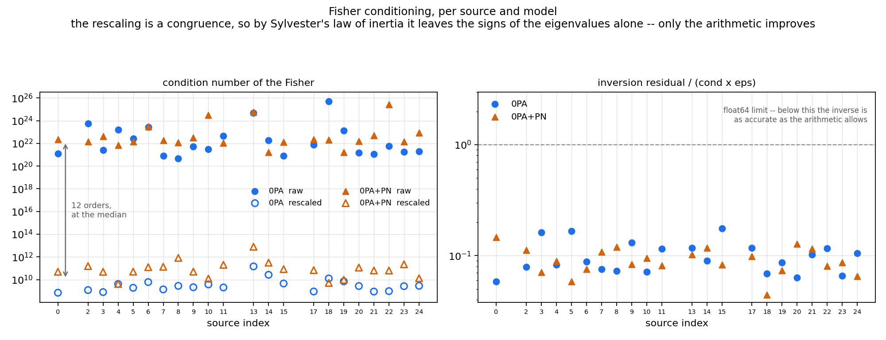

| | |
|---|---|
| `cond raw` | condition number of the Fisher as computed |
| `cond rescaled` | the same after Jacobi rescaling -- the number that governs the arithmetic |
| `min eig (scaled)` | smallest eigenvalue of the rescaled covariance; its **sign** is the real inertia |
| `inv residual` | `max\|G_hat C_hat - I\|`.  The direct test: does the inverse actually invert |
| `/ float64 limit` | the same residual divided by `cond_rescaled * 2.2e-16`.  **This is the column to read** -- an absolute residual is meaningless without the conditioning it was achieved at, and a value below 1 means the inversion is as accurate as double precision allows |
| `rank` | eigenvalues above `max(eig) * eps` -- a deficit means a genuinely dead direction |

| idx | model | cond raw | cond rescaled | min eig (scaled) | inv residual | / float64 limit | rank | pos def |
|---|---|---|---|---|---|---|---|---|
| 0 | `0PA` | 1.23e+21 | 7.13e+08 | 1.47e-01 | 9.25e-09 | 0.06 | 8/8 | yes |
| 0 | `0PA+PN` | 2.17e+22 | 4.96e+10 | 1.34e-01 | 1.61e-06 | 0.15 | 9/9 | yes |
| 2 | `0PA` | 5.41e+23 | 1.21e+09 | 1.59e-01 | 2.14e-08 | 0.08 | 8/8 | yes |
| 2 | `0PA+PN` | 1.42e+22 | 1.56e+11 | 1.49e-01 | 3.89e-06 | 0.11 | 9/9 | yes |
| 3 | `0PA` | 2.54e+21 | 8.05e+08 | 1.81e-01 | 2.90e-08 | 0.16 | 8/8 | yes |
| 3 | `0PA+PN` | 4.28e+22 | 4.91e+10 | 1.40e-01 | 7.72e-07 | 0.07 | 9/9 | yes |
| 4 | `0PA` | 1.66e+23 | 4.19e+09 | 1.45e-01 | 7.68e-08 | 0.08 | 8/8 | yes |
| 4 | `0PA+PN` | 6.62e+21 | 4.22e+09 | 1.38e-01 | 8.33e-08 | 0.09 | 9/9 | yes |
| 5 | `0PA` | 2.62e+22 | 1.93e+09 | 1.80e-01 | 7.14e-08 | 0.17 | 8/8 | yes |
| 5 | `0PA+PN` | 1.43e+22 | 5.06e+10 | 1.35e-01 | 6.55e-07 | 0.06 | 9/9 | yes |
| 6 | `0PA` | 2.64e+23 | 6.16e+09 | 1.51e-01 | 1.20e-07 | 0.09 | 8/8 | yes |
| 6 | `0PA+PN` | 2.92e+23 | 1.26e+11 | 1.31e-01 | 2.10e-06 | 0.08 | 9/9 | yes |
| 7 | `0PA` | 7.82e+20 | 1.39e+09 | 1.47e-01 | 2.33e-08 | 0.08 | 8/8 | yes |
| 7 | `0PA+PN` | 1.86e+22 | 1.36e+11 | 1.24e-01 | 3.26e-06 | 0.11 | 9/9 | yes |
| 8 | `0PA` | 4.78e+20 | 2.84e+09 | 1.50e-01 | 4.60e-08 | 0.07 | 8/8 | yes |
| 8 | `0PA+PN` | 1.17e+22 | 8.25e+11 | 1.38e-01 | 2.19e-05 | 0.12 | 9/9 | yes |
| 9 | `0PA` | 5.13e+21 | 2.15e+09 | 1.69e-01 | 6.27e-08 | 0.13 | 8/8 | yes |
| 9 | `0PA+PN` | 3.17e+22 | 5.07e+10 | 1.39e-01 | 9.37e-07 | 0.08 | 9/9 | yes |
| 10 | `0PA` | 3.06e+21 | 3.83e+09 | 1.49e-01 | 6.07e-08 | 0.07 | 8/8 | yes |
| 10 | `0PA+PN` | 3.15e+24 | 1.23e+10 | 1.30e-01 | 2.59e-07 | 0.09 | 9/9 | yes |
| 11 | `0PA` | 4.36e+22 | 2.06e+09 | 1.58e-01 | 5.28e-08 | 0.12 | 8/8 | yes |
| 11 | `0PA+PN` | 1.04e+22 | 2.02e+11 | 1.36e-01 | 3.64e-06 | 0.08 | 9/9 | yes |
| 13 | `0PA` | 4.81e+24 | 1.47e+11 | 1.42e-01 | 3.85e-06 | 0.12 | 8/8 | yes |
| 13 | `0PA+PN` | 5.82e+24 | 7.84e+12 | 1.24e-01 | 1.77e-04 | 0.10 | 9/9 | yes |
| 14 | `0PA` | 1.80e+22 | 2.69e+10 | 1.65e-01 | 5.38e-07 | 0.09 | 8/8 | yes |
| 14 | `0PA+PN` | 1.67e+21 | 3.13e+11 | 1.20e-01 | 8.14e-06 | 0.12 | 9/9 | yes |
| 15 | `0PA` | 7.79e+20 | 4.61e+09 | 1.46e-01 | 1.81e-07 | 0.18 | 8/8 | yes |
| 15 | `0PA+PN` | 1.25e+22 | 8.45e+10 | 1.28e-01 | 1.56e-06 | 0.08 | 9/9 | yes |
| 17 | `0PA` | 7.33e+21 | 9.12e+08 | 1.68e-01 | 2.37e-08 | 0.12 | 8/8 | yes |
| 17 | `0PA+PN` | 2.26e+22 | 6.91e+10 | 1.38e-01 | 1.51e-06 | 0.10 | 9/9 | yes |
| 18 | `0PA` | 4.88e+25 | 1.28e+10 | 1.40e-01 | 1.94e-07 | 0.07 | 8/8 | yes |
| 18 | `0PA+PN` | 2.04e+22 | 5.13e+09 | 1.23e-01 | 5.05e-08 | 0.04 | 9/9 | yes |
| 19 | `0PA` | 1.35e+23 | 7.12e+09 | 1.49e-01 | 1.37e-07 | 0.09 | 8/8 | yes |
| 19 | `0PA+PN` | 1.61e+21 | 9.78e+09 | 1.30e-01 | 1.59e-07 | 0.07 | 9/9 | yes |
| 20 | `0PA` | 1.52e+21 | 2.75e+09 | 1.53e-01 | 3.86e-08 | 0.06 | 8/8 | yes |
| 20 | `0PA+PN` | 1.49e+22 | 1.16e+11 | 1.46e-01 | 3.28e-06 | 0.13 | 9/9 | yes |
| 21 | `0PA` | 1.09e+21 | 8.97e+08 | 1.52e-01 | 2.04e-08 | 0.10 | 8/8 | yes |
| 21 | `0PA+PN` | 4.89e+22 | 6.48e+10 | 1.32e-01 | 1.66e-06 | 0.12 | 9/9 | yes |
| 22 | `0PA` | 5.70e+21 | 9.81e+08 | 1.54e-01 | 2.53e-08 | 0.12 | 8/8 | yes |
| 22 | `0PA+PN` | 2.70e+25 | 6.39e+10 | 1.35e-01 | 1.15e-06 | 0.08 | 9/9 | yes |
| 23 | `0PA` | 1.85e+21 | 2.68e+09 | 1.48e-01 | 3.91e-08 | 0.07 | 8/8 | yes |
| 23 | `0PA+PN` | 1.39e+22 | 2.25e+11 | 1.33e-01 | 4.33e-06 | 0.09 | 9/9 | yes |
| 24 | `0PA` | 1.90e+21 | 2.87e+09 | 1.52e-01 | 6.69e-08 | 0.11 | 8/8 | yes |
| 24 | `0PA+PN` | 8.60e+22 | 1.34e+10 | 1.32e-01 | 1.94e-07 | 0.07 | 9/9 | yes |

## Caveats

* Conditioning is treated in its own section above.  The residuals say the inversions are
  sound; that is a statement about arithmetic, not about physics.  A well-conditioned Fisher
  at a fit that only reaches overlap 0.77 is still the wrong error model, because the
  likelihood there is nowhere near Gaussian.  The absolute bias remains the solid quantity.
* `dt = 10` aliasing is an accepted fidelity caveat, carried over from the population run.
* The run depends on an uncommitted patch to `flux.py` on branch `environ_shubham`, so it
  is not reproducible from a clean checkout as things stand.

## Files

| file | what it is |
|---|---|
| `idx*.json` | one record per source: both fits, both Fishers, bias, b/sigma |
| `bias_panels.png`, `overlap.png` | the per-parameter figures, from `plot_results.py` |
| `max_bias*.png`, `nd_bias*.png` | the per-source summaries; `_with_e0` keeps `e0`, `_p90` is the 90% level |
| `improvement*.png` | the factor by which PN beats 0PA, on all three quantities |
| `intrinsic/` | the same figures over `m1, m2, a, p0` only, with their own `README.md` |
| `conditioning.png` | raw vs rescaled condition number, and the inversion residual |
| `README.md` | this page, from `make_results_md.py` |
| `METHOD.md` | what was done and every assumption it rests on -- written by hand, not generated |
| `../results_inputs.py` | which sources enter, and where each fit is read from |
| `../refit_fisher.py` | the order-8 Fisher job that wrote the `idx*.json` |
| `../batch_refit_fisher_[ab].sh` | its two PBS scripts |
